# Implementation Plan

## Index

- [Step 1 - Repo skeleton + GitHub App setup](#step-1---repo-skeleton--github-app-setup)
- [Step 2 - Invoke-GitHubApi in Infrastructure-Common](#step-2---invoke-githubapi-in-infrastructure-common)
- [Step 3 - GitHub App authentication in Infrastructure-Common](#step-3---github-app-authentication-in-infrastructure-common)
- [Step 4 - Deployments API in Infrastructure-Common](#step-4---deployments-api-in-infrastructure-common)
- [Step 5 - Migrate Infrastructure-GitHubRunners to Invoke-GitHubApi](#step-5---migrate-infrastructure-githubrunners-to-invoke-githubapi)
- [Step 6 - Polling agent](#step-6---polling-agent)
- [Step 7 - GitHub Actions workflow](#step-7---github-actions-workflow)
- [Step 8 - VM provisioning E2E test](#step-8---vm-provisioning-e2e-test)
- [Step 9 - VM users E2E test](#step-9---vm-users-e2e-test)
- [Step 10 - Runner lifecycle E2E test](#step-10---runner-lifecycle-e2e-test)
- [Step 11 - Cross-repo trigger workflows](#step-11---cross-repo-trigger-workflows)

---

## Step 1 - Repo skeleton + GitHub App setup

**What:** Create the directory structure and document the one-time
manual GitHub App registration steps.

```
.github/
  workflows/
    e2e.yml                                       (placeholder)
agent/
  e2e/
    vm-provisioning/
      Invoke-VmProvisioningTest.ps1               (placeholder)
    vm-users/
      Invoke-VmUsersTest.ps1                      (placeholder)
    runner-lifecycle/
      Invoke-RunnerLifecycleTest.ps1              (placeholder)
  Start-E2EAgent.ps1                             (placeholder)
docs/
  dev/
    implementation/
      01 - initial implementation/
        problem.md
        plan.md
```

**Why:** Establishes the shape of the repo before any logic is written.
GitHub App registration is a one-time manual step that must happen
before any code can authenticate - documenting it here ensures it is
not skipped. GitHub API functions are not scaffolded here because they
live in `Infrastructure-Common` (steps 2, 3, 4).

**GitHub App registration (manual, one-time):**
1. Create app at `github.com/settings/apps/new`
2. Set permissions:

   | Permission | Repo | Purpose |
   |---|---|---|
   | `deployments: write` | Infrastructure-E2E | Agent lists pending deployments + posts status |
   | `contents: write` | Infrastructure-E2E | Trigger workflows fire `repository_dispatch` |
   | `actions: write` | Infrastructure-GitHubRunners | Agent gets runner registration token + manages runners |

3. Generate and download private key (.pem)
4. Install app on all four repos: `Infrastructure-E2E`,
   `Infrastructure-Vm-Provisioner`, `Infrastructure-Vm-Users`,
   `Infrastructure-GitHubRunners`. Note each installation ID.
5. Store in vault `E2EConfig` via `Infrastructure.Secrets`:
   - App ID
   - Private key path
   - Installation ID for `Infrastructure-E2E` (used to get a
     `deployments: write` token for deployment polling)
   - Installation ID for `Infrastructure-GitHubRunners` (used to get
     an `actions: write` token for runner management)
6. Store `GH_APP_ID`, `GH_APP_PRIVATE_KEY`, and
   `GH_E2E_INSTALLATION_ID` as Actions secrets in each of the three
   trigger repos (`Infrastructure-Vm-Provisioner`,
   `Infrastructure-Vm-Users`, `Infrastructure-GitHubRunners`) - read
   by their trigger workflows to obtain a `contents: write` token
   scoped to `Infrastructure-E2E`

**README update:** Add repo overview, prerequisites, and GitHub App
setup instructions.

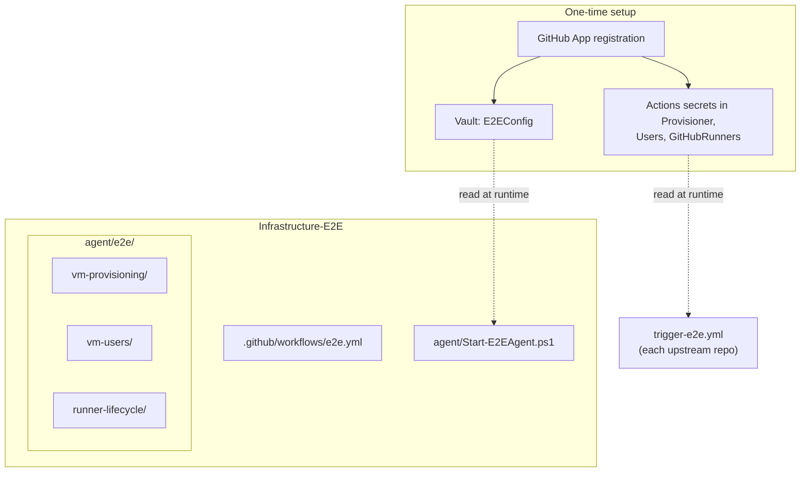

---

## Step 2 - Invoke-GitHubApi in Infrastructure-Common

**What:** New function
`Infrastructure.Common\Public\Invoke-GitHubApi.ps1` - a general-purpose
GitHub REST API caller.

Parameters:
- `-Token` (mandatory) - bearer token; accepts both PATs and GitHub
  App installation tokens interchangeably
- `-Uri` (mandatory) - full API URI
- `-Method` (default `'Get'`)
- `-Body` (optional) - hashtable, serialized to JSON automatically

Sets `Authorization: Bearer`, `User-Agent: Infrastructure`, and
`Content-Type: application/json` on every request. Returns the raw
`Invoke-RestMethod` response.

Update `Infrastructure.Common.psm1` to dot-source the new function.
The `.psd1` version and `FunctionsToExport` are updated once in step 4
when all Common additions are complete.

**Why:** Centralizing the GitHub HTTP call in Common gives all
infrastructure repos a single consistent caller with uniform headers
and error surface. Naming the parameter `-Token` rather than `-Pat`
from the start avoids a future rename when GitHub App tokens replace
PATs.

**Tests:** Unit - mock `Invoke-RestMethod`; assert Authorization header,
User-Agent, Method, and Body serialization for each combination of
parameters.

**README update:** Add `Invoke-GitHubApi` to the Infrastructure-Common
function reference.

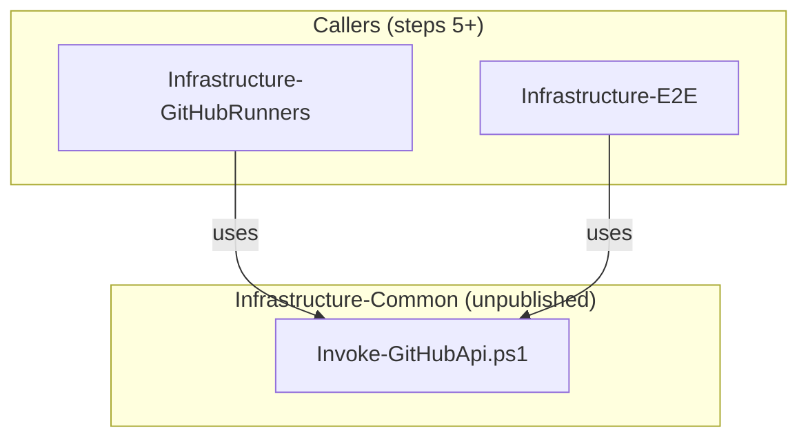

---

## Step 3 - GitHub App authentication in Infrastructure-Common

**What:** New function
`Infrastructure.Common\Public\Get-GitHubAppToken.ps1` - given app ID,
installation ID, and private key path, returns a short-lived
installation access token.

Steps:
1. Build JWT header + payload (`iat`, `exp`, `iss`=appId), sign with
   RS256 using the private key (.pem)
2. Call `Invoke-GitHubApi` with the JWT as Bearer token:
   `POST /app/installations/{installationId}/access_tokens`
3. Return `token` and `expires_at` from the response

Update `Infrastructure.Common.psm1` to dot-source the new function.
The `.psd1` version and `FunctionsToExport` are updated in step 4.

**Why:** Authentication is cross-cutting - both the polling agent and
any infrastructure repo that needs to call the GitHub API without a PAT
will use this. Implemented on top of `Invoke-GitHubApi` so the HTTP
concerns stay in one place.

**Tests:** Unit - assert JWT claims structure and RS256 signing with a
test key; assert `Invoke-GitHubApi` is called with the correct endpoint
and JWT as Bearer.

**README update:** Add `Get-GitHubAppToken` to the Infrastructure-Common
function reference.

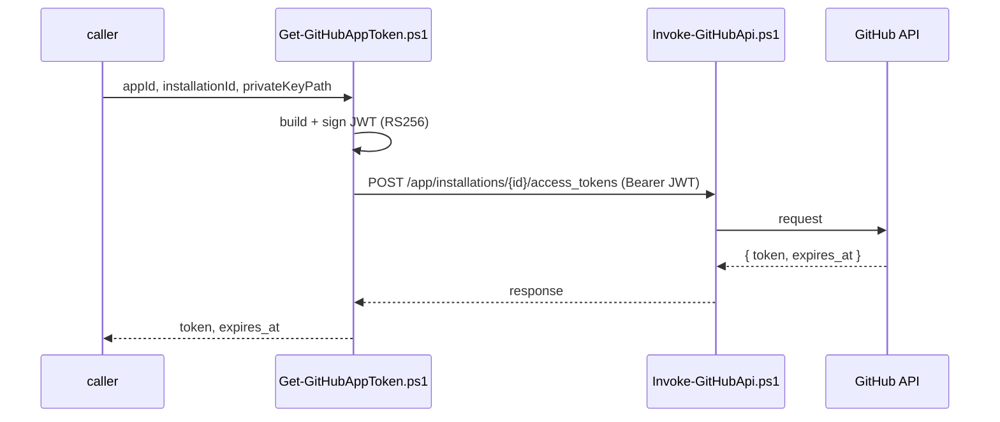

---

## Step 4 - Deployments API in Infrastructure-Common

**Version bump:** `1.2.1` -> `1.3.1`

**What:** Two new functions:

- `Infrastructure.Common\Public\Get-PendingDeployment.ps1` - calls
  `GET /repos/{owner}/{repo}/deployments?environment=e2e-workstation`
  via `Invoke-GitHubApi`, filters to entries with no terminal status
  (`success`, `failure`, `error`, `inactive`), returns the oldest
  pending one or `$null`
- `Infrastructure.Common\Public\Set-DeploymentStatus.ps1` - calls
  `POST /repos/{owner}/{repo}/deployments/{id}/statuses` via
  `Invoke-GitHubApi` with state, description, and optional log URL

Update `Infrastructure.Common.psm1` to dot-source both new functions.
Bump `ModuleVersion` to `1.3.1` in the `.psd1` and add all four new
functions to `FunctionsToExport`:
`Invoke-GitHubApi`, `Get-GitHubAppToken`, `Get-PendingDeployment`,
`Set-DeploymentStatus`.

**Why:** Deployment signaling is the coordination mechanism between
the GitHub Actions workflow and the polling agent. Placing it in Common
keeps `Infrastructure-E2E` free of raw HTTP concerns and makes the
functions available to any future repo that needs deployment-based
signaling. The version bump is consolidated here so only one publish
is needed for all four new functions.

**Tests:** Unit - mock `Invoke-GitHubApi`; assert filtering logic in
`Get-PendingDeployment`; assert request body shape in
`Set-DeploymentStatus`.

**README update:** Add `Get-PendingDeployment` and
`Set-DeploymentStatus` to the Infrastructure-Common function reference.

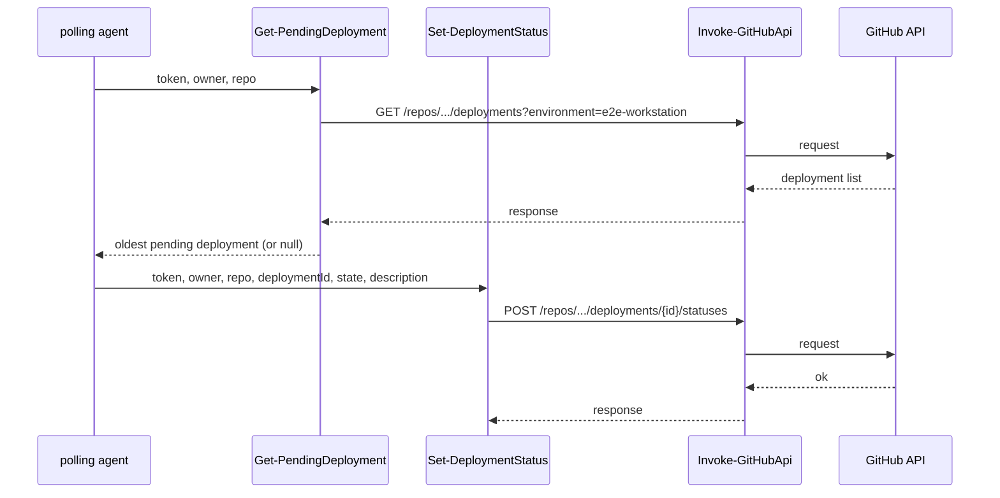

---

## Step 5 - Migrate Infrastructure-GitHubRunners to Invoke-GitHubApi

**What:** Replace `Invoke-GitHubRunnersApi.ps1` with calls to
`Invoke-GitHubApi` from `Infrastructure-Common`. Rename `-Pat` to
`-Token` throughout the repo. Raise the minimum required
`Infrastructure.Common` version to `1.3.1`.

Changes:
1. Delete
   `hyper-v/ubuntu/registration/common/github/Invoke-GitHubRunnersApi.ps1`
2. Update all callers (`Get-GitHubRunnerRegistration.ps1`,
   `Remove-GitHubRunner.ps1`, `Resolve-RunnerVersion.ps1`) to call
   `Invoke-GitHubApi` directly with a full `-Uri`
3. Rename `-Pat` to `-Token` in all function signatures and call sites
4. Update `setup-secrets.ps1`, `register-runners.ps1`, and
   `deregister-runners.ps1` to require minimum version `1.3.1`
5. Update all tests that reference `-Pat` or `Invoke-GitHubRunnersApi`

**Why:** Removes the duplicate HTTP caller and aligns the repo with the
Common module. Renaming `-Pat` to `-Token` prepares the functions to
accept GitHub App tokens in step 10 without a further signature change.
This step must follow the Common publish so the repo can install the
version it requires.

**Tests:** Existing unit tests updated - mock `Invoke-GitHubApi`
instead of `Invoke-GitHubRunnersApi`; assert `-Token` parameter is
passed through correctly.

**README update:** Update Infrastructure-GitHubRunners README to note
`Infrastructure.Common >= 1.3.1` as a prerequisite.

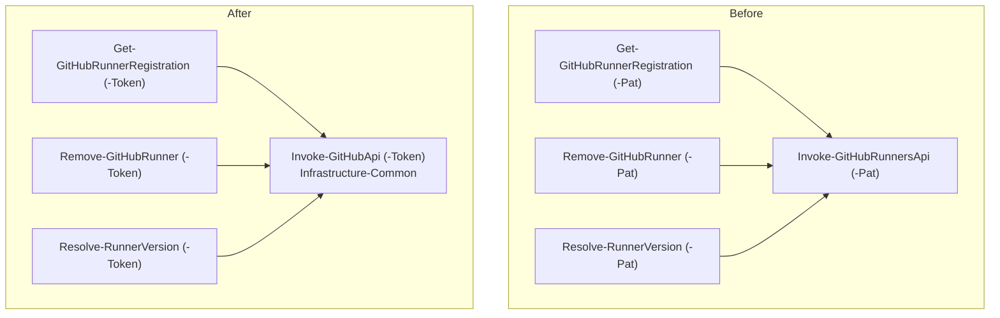

---

## Step 6 - Polling agent

**What:** `agent/Start-E2EAgent.ps1` - the script the operator runs
manually on the workstation.

1. Reads `E2EConfig` from vault (app ID, installation IDs, private key
   path, poll interval, timeout minutes)
2. Calls `Get-GitHubAppToken` (E2E installation) to obtain a
   deployment token
3. Polls `Get-PendingDeployment` every N seconds until a deployment is
   found or the timeout is reached
4. If token is within 5 minutes of expiry, refreshes it before the
   next poll (installation tokens last 1 hour)
5. When a deployment is found: calls `Set-DeploymentStatus`
   `in_progress`, then calls `Invoke-RunnerLifecycleTest`
6. On success: `Set-DeploymentStatus success`
7. On failure: `Set-DeploymentStatus failure` with error message
8. Exits cleanly on timeout with a console message

**Why:** The agent is the bridge between GitHub's deployment signal
and the local Hyper-V environment. Token refresh avoids a mid-test
authentication failure for long-running provisioning sequences. The
timeout ensures the script does not run indefinitely if no workflow
dispatches a deployment.

**Tests:** Unit - mock `Get-GitHubAppToken`, `Get-PendingDeployment`,
`Set-DeploymentStatus`, and `Invoke-RunnerLifecycleTest`; assert poll
loop behaviour (found on first poll, found on Nth poll, timeout exit,
token refresh trigger, failure path).

**README update:** Add "How to run the polling agent" section with
start command and expected console output.

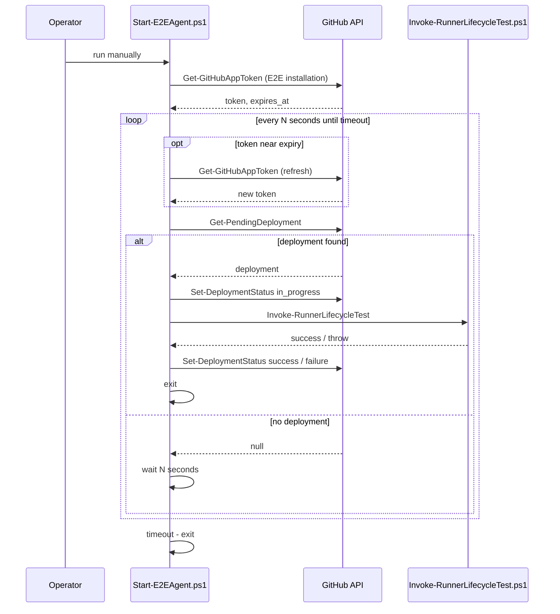

---

## Step 7 - GitHub Actions workflow

**What:** `.github/workflows/e2e.yml` with three triggers:
`workflow_dispatch` (manual), `schedule` (nightly,
`cron: '0 2 * * *'`), and `repository_dispatch` with event type
`trigger-e2e` (fired by all three upstream repos on push to master).

Steps:
1. Create deployment: `POST /repos/{owner}/{repo}/deployments`
   (`GITHUB_TOKEN`, `environment: e2e-workstation`,
   `auto_merge: false`, `required_contexts: []`)
2. Poll `GET /repos/{owner}/{repo}/deployments/{id}/statuses` every
   30 seconds until a terminal status or 30-minute timeout
3. Fail the workflow if the terminal status is `failure` or `error`;
   pass if `success`; fail on timeout

`GITHUB_TOKEN` permissions required: `deployments: write`
(own repo only - sufficient, no cross-repo access needed here).

**Why:** `workflow_dispatch` lets the operator trigger on demand.
The schedule provides nightly regression coverage. `repository_dispatch`
enables automatic triggering from any upstream repo on push - the full
E2E test always runs regardless of which repo changed, since a broken
VM or missing user will break runner registration just as much as a
broken runner script. `GITHUB_TOKEN` is sufficient because the
deployment lives in the same repo as the workflow.

**Tests:** No unit tests for the workflow YAML itself. Verified
end-to-end in steps 8-10 by running the workflow manually with the
polling agent.

**README update:** Add "How to trigger" section covering all three
trigger paths and how to read results in the GitHub Deployments UI.

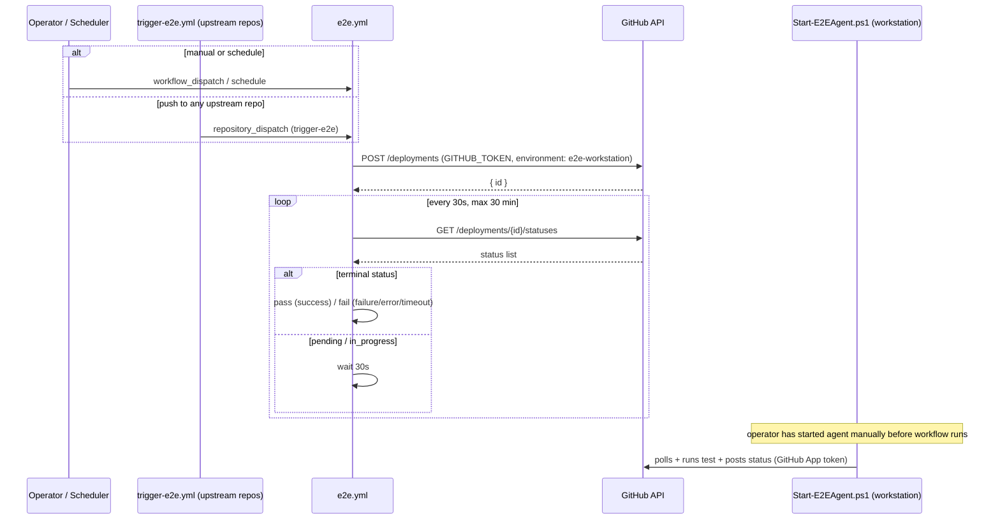

---

## Step 8 - VM provisioning E2E test

**What:** `agent/e2e/vm-provisioning/Invoke-VmProvisioningTest.ps1` -
the first and lowest layer of E2E coverage.

1. Provision Ubuntu VM via `Infrastructure-Vm-Provisioner` scripts
2. Assert VM is reachable via SSH
3. Destroy VM (in `finally` block)

**Why:** Establishes the provisioning layer as a verified baseline
before higher layers are built on top of it. Keeping it separate means
provisioning failures are immediately identifiable without runner or
user concerns in the stack trace.

**Tests:** None - the script is thin orchestration; correctness is
verified by running it.

**README update:** Add test coverage section documenting what the
provisioning test verifies.

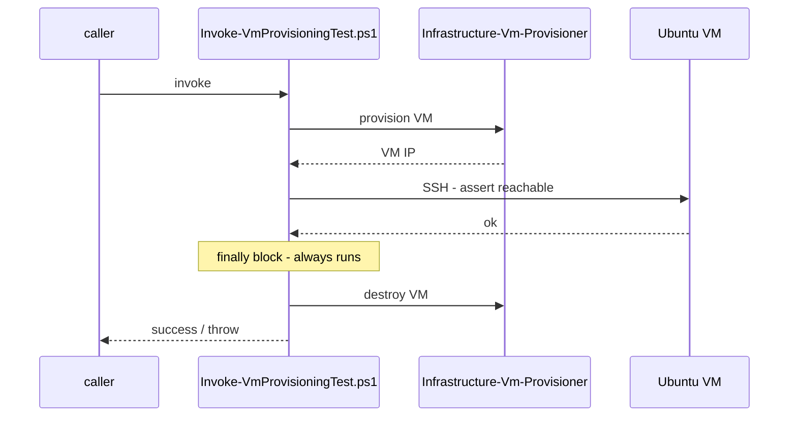

---

## Step 9 - VM users E2E test

**What:** `agent/e2e/vm-users/Invoke-VmUsersTest.ps1` - extends the
provisioning layer with user setup verification.

1. Call `Invoke-VmProvisioningTest` setup phase (provision VM, get IP)
   - reuses provisioning without duplicating it
2. Set up users via `Infrastructure-Vm-Users` scripts
3. Assert expected users and groups exist on the VM via SSH
4. Destroy VM (in `finally` block)

**Why:** Builds directly on the verified provisioning layer. If this
test passes, the VM and its users are confirmed correct - runner
registration can rely on both.

**Tests:** None - the script is thin orchestration; correctness is
verified by running it.

**README update:** Expand test coverage section with users test.

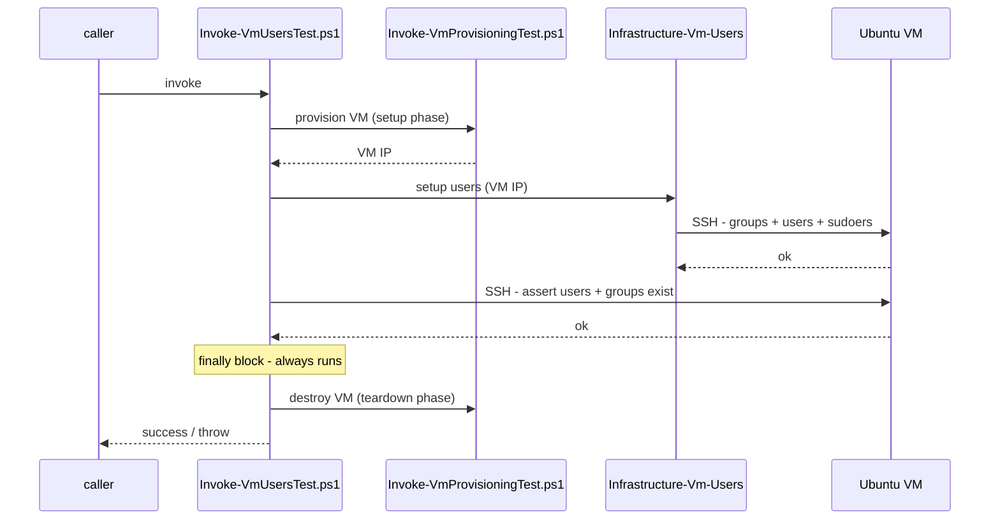

---

## Step 10 - Runner lifecycle E2E test

**What:** `agent/e2e/runner-lifecycle/Invoke-RunnerLifecycleTest.ps1` -
the full E2E test, extending the users layer with runner registration
and verification. This is the script the polling agent calls.

1. Call `Invoke-VmUsersTest` setup phase (provision VM + users, get IP)
   - reuses the verified users layer without duplicating it
2. Register runner via `Infrastructure-GitHubRunners`
   `register-runners.ps1`, passing the GitHub App token obtained via
   `Get-GitHubAppToken` (GitHubRunners installation)
3. Assert runner service is active on the VM via SSH:
   `systemctl is-active actions.runner.*`
4. Assert runner appears online via GitHub API:
   `GET /repos/{owner}/{repo}/actions/runners` via `Invoke-GitHubApi`
5. Deregister runner via `Infrastructure-GitHubRunners`
   `deregister-runners.ps1`
6. Destroy VM via the users layer teardown phase (in `finally` block)

**Prerequisite:** `Infrastructure-GitHubRunners` runner scripts accept
`-Token` after step 5 - no further change needed here.

**Why:** Reuses the verified provisioning and users layers - only the
runner-specific setup, assertions, and teardown are new here. The full
stack always runs since a broken VM or missing user will break runner
registration regardless of which repo triggered the test.

**Tests:** None - the script is thin orchestration; correctness is
verified by running it.

**README update:** Expand test coverage section with runner lifecycle
test; add the full end-to-end flow diagram.

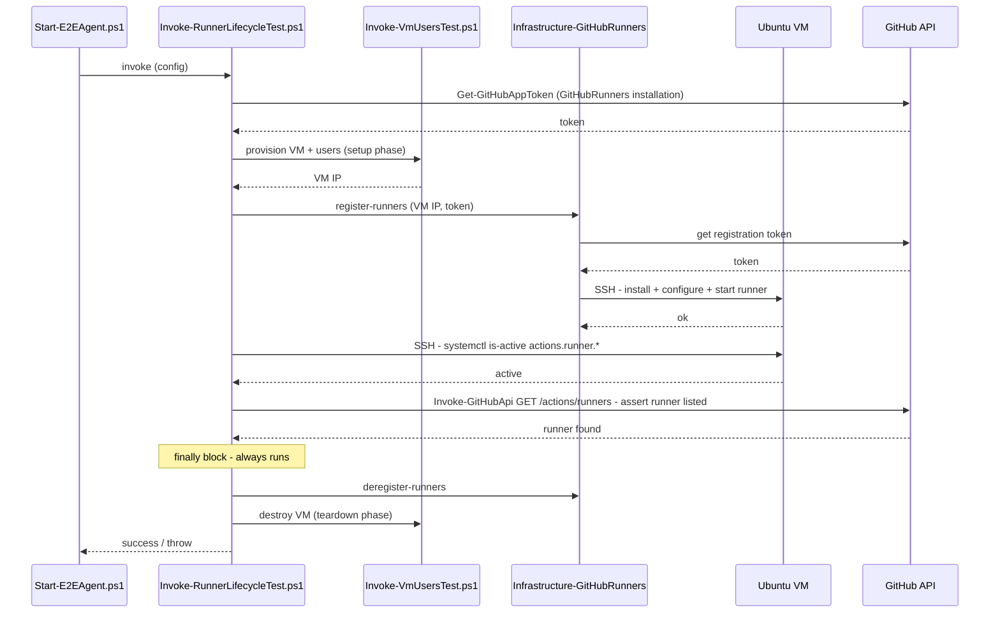

---

## Step 11 - Cross-repo trigger workflows

**What:** Identical `.github/workflows/trigger-e2e.yml` added to each
of the three upstream repos, triggered on push to master:

- `Infrastructure-Vm-Provisioner`
- `Infrastructure-Vm-Users`
- `Infrastructure-GitHubRunners`

Each workflow:
1. Uses `GH_APP_ID`, `GH_APP_PRIVATE_KEY`, and
   `GH_E2E_INSTALLATION_ID` Actions secrets to obtain a GitHub App
   token scoped to `Infrastructure-E2E` (`contents: write`)
2. `POST /repos/{owner}/Infrastructure-E2E/dispatches` with event type
   `trigger-e2e` and the App token as Bearer

**Why:** Any push to any layer of the provisioning pipeline runs the
full E2E test automatically. A broken VM, missing user, or broken
runner script all produce a failed runner - testing the full stack on
every change catches regressions at source. The `repository_dispatch`
mechanism keeps the upstream repos decoupled from `Infrastructure-E2E`
internals.

**Tests:** No unit tests for the workflow YAML itself. Verified by
pushing to each upstream repo's master and confirming the E2E workflow
is triggered.

**README update:** Add "Automated triggers" section listing which
upstream repos fire E2E tests and when.

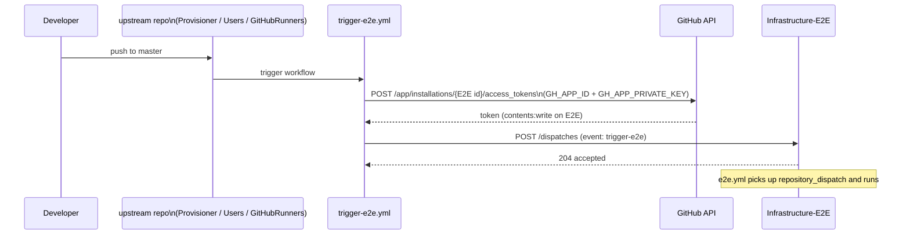
