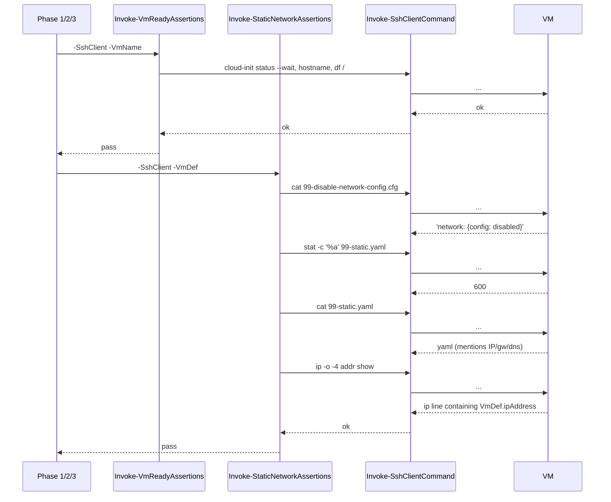

# 18 - Static netplan assertions - plan

Background and rationale: see [problem.md](./problem.md).

## Index

- [Step 1 - Add `Invoke-StaticNetworkAssertions` and wire it into every phase](#step-1---add-invoke-staticnetworkassertions-and-wire-it-into-every-phase)

---

## Step 1 - Add `Invoke-StaticNetworkAssertions` and wire it into every phase

**Reason.** A single self-contained step is the natural shape here.
The new helper is one assertion module; the wiring is one call per
VM-touching block in each phase. Splitting would force a window
where the helper exists but is unused, or worse a window where the
phases call a function that does not yet exist. Both flunk the
"committable per step" rule.

**Scope.**

- New
  [`agent/e2e/vm-provisioning/Invoke-StaticNetworkAssertions.ps1`](../../../../agent/e2e/vm-provisioning/Invoke-StaticNetworkAssertions.ps1)
  exporting `Invoke-StaticNetworkAssertions -SshClient -VmDef`.
  Reuses `Invoke-SshClientCommand` (no new transport). Checks:
  - `/etc/cloud/cloud.cfg.d/99-disable-network-config.cfg` reads
    exactly `network: {config: disabled}` (string equality - cloud-init
    parses this verbatim).
  - `stat -c '%a' /etc/netplan/99-static.yaml` returns `600`.
  - `cat /etc/netplan/99-static.yaml` contains `VmDef.ipAddress`,
    `VmDef.gateway`, and `VmDef.dns` as substrings - cheap structural
    check that the file is the one `New-StaticNetplanYaml` produced for
    this VM, without cross-repo import.
  - `ip -o -4 addr show` lists `VmDef.ipAddress` on some interface -
    proves netplan actually bound the address, not just that the file
    landed on disk.
  - Each check throws on failure with a message naming the VM and the
    observed value; the outer `try/finally` in the calling test still
    runs teardown.
- Dot-source the new file from
  [`Invoke-VmProvisioningTest.ps1`](../../../../agent/e2e/vm-provisioning/Invoke-VmProvisioningTest.ps1)
  next to the other assertion helpers.
- Call `Invoke-StaticNetworkAssertions` right after `Invoke-VmReadyAssertions`
  in every phase block that opens an SSH client:
  - Phase 1 - VM1 (post-provision).
  - Phase 2 - VM1 (post-uninstall) AND VM2 (newly created). VM2
    previously only ran `Invoke-NoJdkVmAssertions`; this step also
    folds in `Invoke-VmReadyAssertions` for VM2 so the new network
    check has a healthy-VM baseline to assume.
  - Phase 3 - VM1 (post-reinstall) AND VM2 (re-verify). Same VM2
    treatment as phase 2.

**Tests.**

- No new unit tests. The helper is direct SSH probes; mocked tests
  would assert that mocks return what the mocks were told to return.
  Existing assertion helpers in this directory
  (`Invoke-JdkInstallAssertions`, `Invoke-FileTransferAssertions`,
  etc.) have the same shape and the same no-unit-test policy - the
  whole layer is "verified by being part of the E2E run." Adding
  unit tests for this one would break that convention without
  catching a class of bug the convention misses.
- The integration coverage IS the test. Each phase fails fast with
  a named-VM, named-value error message if any artefact is missing
  or wrong.

**Diagram.**

